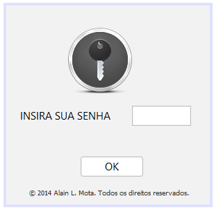
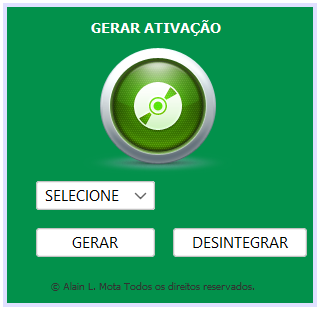
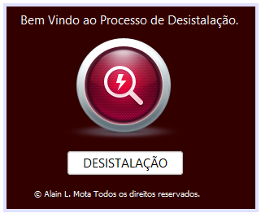

## Proteção de Pasta

Este projeto foi desenvolvido com o objetivo de criar um pasta projegida por senha, para garantir que os arquivos não sejam violados por curiosos, ocultando e evitando serem apagados por engano.

### Tecnologia
Aqui estão as tecnologias utilizadas neste projeto.

* Java SE 8 (LTS)

### Serviços Usados
* Github
* NetBeans 8.0

### Plataforma compatíveis
* Windows

### Situação do Projeto
Projeto de software descontinuado.

### Interface

### Recursos
* Cria um pasta criptografada
* Bloqueia os arquivos contra a exclusão 

### Links
* [Repository](https://github.com/AlainMota9/Protecao_Pasta)
* [Facebook](https://www.facebook.com/alain.mota.3/)
* [Lattes](http://lattes.cnpq.br/9940114103826916)
* [linkedin](https://www.linkedin.com/in/alain-mota-a61319117/)

### Controle de versão
1.0.0.0

### Autor
Alain L. Mota: [@AlainMota](https://github.com/AlainMota9)

#### Obrigado pela Visita!

